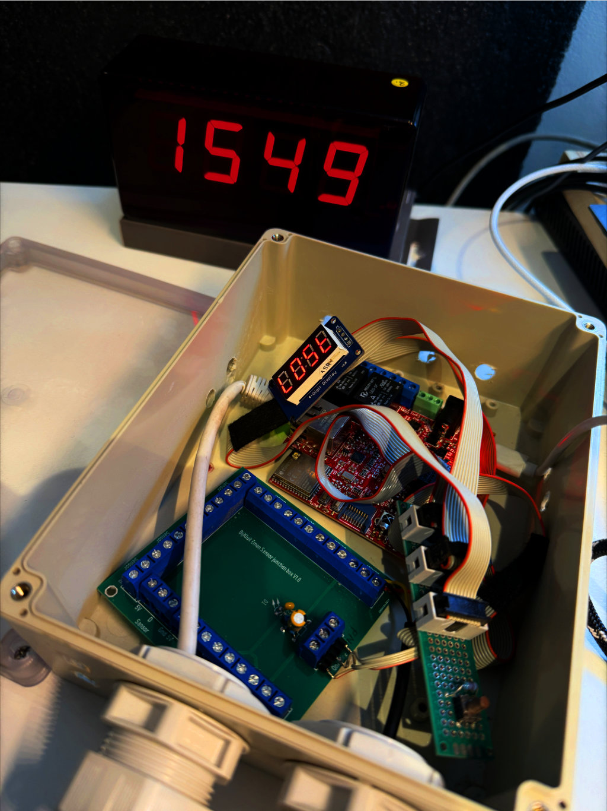

# Hot and Bothered SensorHub

ESP32-based temperature monitoring and relay-control hub for heating, hot-water, and technical installation monitoring.

Hot and Bothered started as a very practical fix for a very practical problem: after a new heating and hot-water setup with a pellet boiler, solar collectors, PV, and a fair amount of system complexity, a power cut or boiler fault could mean starting the day with a cold shower.

A set of DS18B20 temperature sensors was added to the installation, and this SensorHub was built to collect the readings and publish them to MQTT. What began as a personal reliability project quickly proved useful in a broader service context as well: the same sensor data can make remote monitoring, diagnostics, and pre-visit troubleshooting much easier for installers and service partners.

[ChaoticVolt Website](https://chaoticvolt.eu)

---

## What this repository is

This repository contains the firmware for the **Hot and Bothered SensorHub**: an ESP32-based monitoring node for temperature-heavy technical installations.

Its role is to:

- collect temperature data from multiple DS18B20 sensors
- publish sensor values to MQTT
- expose a local web interface
- support relay-control logic where needed
- integrate cleanly with systems such as Home Assistant or ThingsBoard
- act as the upstream data source for related display and monitoring clients

This repository is the **sensor hub**, not the bathroom display itself.

---

## Why it exists

The original use case was simple:

> before walking across the farm, or stepping into the shower, it was useful to know whether there would actually be hot water.

The heating installation lived elsewhere on the property, far enough away that “just checking the boiler” was not something you wanted to do half asleep in the morning.

So the first goal was straightforward:

- measure the important temperatures
- publish them to MQTT
- make the state of the system visible at a glance

That practical need led to a project that turned out to be useful far beyond the original domestic problem.

---

## Why it became more serious

Once the system was running, it became clear that the same SensorHub could also help installers and service technicians.

For service work, having remote access to a meaningful set of temperatures and states can save time, reduce guesswork, and avoid unnecessary visits. Before driving out to a site, it becomes possible to inspect a number of key parameters and already understand part of the situation.

That makes the SensorHub useful in at least three ways:

- **local reassurance** — is there hot water, and is the system behaving normally?
- **remote monitoring** — publish installation data to MQTT-based monitoring systems
- **service preparation** — inspect key parameters before going on-site

This is one of the reasons the project deserves a cleaner, more stable public presentation than its original quick-project folder history might suggest.

---

## At a glance

- **Role:** temperature monitoring and relay-control hub
- **Platform:** ESP32
- **Sensors:** DS18B20-based temperature inputs
- **Outputs:** MQTT, web UI, relay/control support
- **Integrations:** Home Assistant, ThingsBoard, and other MQTT-driven systems
- **Related project:** bathroom / utility display client
- **Status:** practical platform component with both personal and service-monitoring value

---

## Core responsibilities

### Temperature acquisition

The SensorHub reads multiple DS18B20 sensors distributed across the installation.

Typical use cases include monitoring:

- boiler temperature
- tank or buffer temperature
- supply and return lines
- room or service-space temperature
- other installation-specific thermal points

### MQTT publishing

Sensor values are published to MQTT so they can be consumed by:

- Home Assistant
- ThingsBoard
- custom dashboards
- local displays
- other automation or monitoring layers

### Local web interface

The project includes a web-facing configuration or status layer so the hub can remain practical even without external infrastructure.

### Relay and control support

Where needed, the SensorHub can also participate in relay-control or basic installation-side control logic.

### Upstream data source for related clients

The hub is designed to work well on its own, but it also serves as the data source for a related display project.

---

## Related project: the display

Hot and Bothered also has a sister project: a dedicated display client.

That display was built for a very human reason: it is useful to glance at a display in the bathroom or nearby space and immediately see whether hot water is available, what the important temperatures are, and whether the installation is behaving normally.

In practice, that display grew into more than a hot-water indicator:

- it shows selected sensor values
- it can function as a clock
- it can act as a room sensor display
- it can show installation-relevant status or error conditions

The SensorHub and the display are therefore a good pair:

- **SensorHub** = gathers and publishes the data
- **Display** = turns the data into immediate, practical visibility

The SensorHub remains perfectly useful on its own through MQTT and dashboards, but the display project makes the original use case tangible.

---

## Early long-running prototype

One of the earlier SensorHub prototypes ran for years in real service.

It was not pretty, but it was useful — which is often the more important milestone for this kind of project. That prototype also captures the practical relationship between the hub and the display especially well: one side gathers the installation data, the other makes it glanceable.

This generation was built around an **Olimex ESP32-EVB**, which proved to have frustrating power-on reset behavior that never became fully satisfactory. It is a good example of the kind of platform lesson that only appears after a project has actually lived in the field for a while.

That hardware wrinkle is part of the story, not a reason to hide the prototype. The fact that a rough early build still ran for years says something useful about the project.

---

## Display examples

The display client can show practical installation values at a glance.

Examples from the related display project include:

- boiler temperature
- buffer or tank temperature
- current room or ambient reading
- clock display
- sensor or configuration error states such as `b.EEE`

That error-style state is useful because it makes it obvious when a value is unavailable due to configuration or data-source issues rather than pretending everything is fine.

The dedicated clock/display photos are better kept with the display project itself, but the SensorHub repository should still acknowledge that relationship clearly.

---

## Integrations

This project is especially useful in setups that already use MQTT as a common backbone.

Natural integration targets include:

- **Home Assistant**
- **ThingsBoard**
- custom MQTT dashboards
- installation monitoring stacks
- service-focused diagnostics dashboards

A small system can use the hub purely for local monitoring.
A larger installation or service workflow can use the same data as part of a broader remote-monitoring setup.

---

## Intended audience

This repository may be useful to:

- makers solving a real heating or hot-water monitoring problem
- technically inclined homeowners
- installers who want more visibility into system behavior
- service partners who want a low-friction monitoring node
- anyone looking for a practical ESP32 + DS18B20 + MQTT starting point

---

## Documentation

This repository is a good candidate for documentation in layers:

- `README.md` — overview, purpose, and project role
- `UserGuide.md` — practical setup and day-to-day use
- `docs/` — architecture, MQTT structure, integration notes, development notes
- `local_docs/legacy/` — older notes and raw historical material that no longer belongs on the public front page

---

## Tone and intent

Despite the playful name, this is not just a joke project.

The name reflects the original context and still suits the project well, but the system itself is genuinely useful: it turns a messy thermal installation into something measurable, visible, and easier to reason about.

That combination is part of the charm of the project:

- a real problem
- a practical build
- a bit of personality
- and a clear path from personal hack to serious monitoring component

---

## Notes

This repository should be presented as a practical, characterful monitoring component with real-world value.

It started as a quick answer to “will there be hot water in the morning?” and grew into something that can also help with monitoring, diagnostics, and service preparation.

That story is not baggage.
It is the reason the project makes sense.
